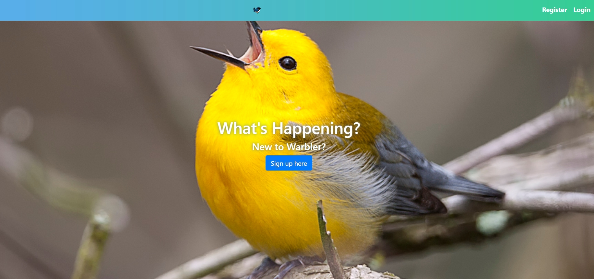

# Warbler (twitter clone)

Warbler is a browser based web application that allows users to sign up and create and edit messages on a global timeline that all users can see and respond to. This app uses a robust modern code base with the MERN stack that is built to be easily scalable.

## Mission

The plan with Warbler was to have and advanced yet clean and organized code base that allows other developers to be able to jump in and quickly familiarize themselves the code base and easily add new features. The app is designed as a twitter clone with modern code and upgradeability in mind.

## Demo The App

- [Click Here](https://warbler-client-nh.herokuapp.com/) to view the application on heroku
- Live Credentials:
  - email: email@example.com
  - password: secret

## Design

This app was designed to be clean and scalable. It uses an organized and intuitive folder structure to manage the vast code base required to utilize React with Redux alongside the back-end API. The app is written using modern asynchronous and/or promise based javascript wherever possible. The app features consistent and uniform error handling. Errors are managed by a single file in the back-end and managed in the redux global state on the front-end, allowing the app to display clear and specific error messages to the user. The code base is set up to easily expand features and be familiarized quickly with new Devs. The app also features in depth authentication and authorization methods with json web tokens, and even includes rehydration, allowing the user to stay authenticated, even if the server disconnects for any reason. The app makes use of bootstrap for a clean mobile responsive web page.

## Tools and Technologies

- Node
- Express
- React
- Redux
- Thunk
- MongoDB
- Mongoose
- JWT
- Bcrypt
- Axios
- Bootstrap
- Moment

## Contributors

- [Nicholas Herrick](https://github.com/nicholasherrick)
